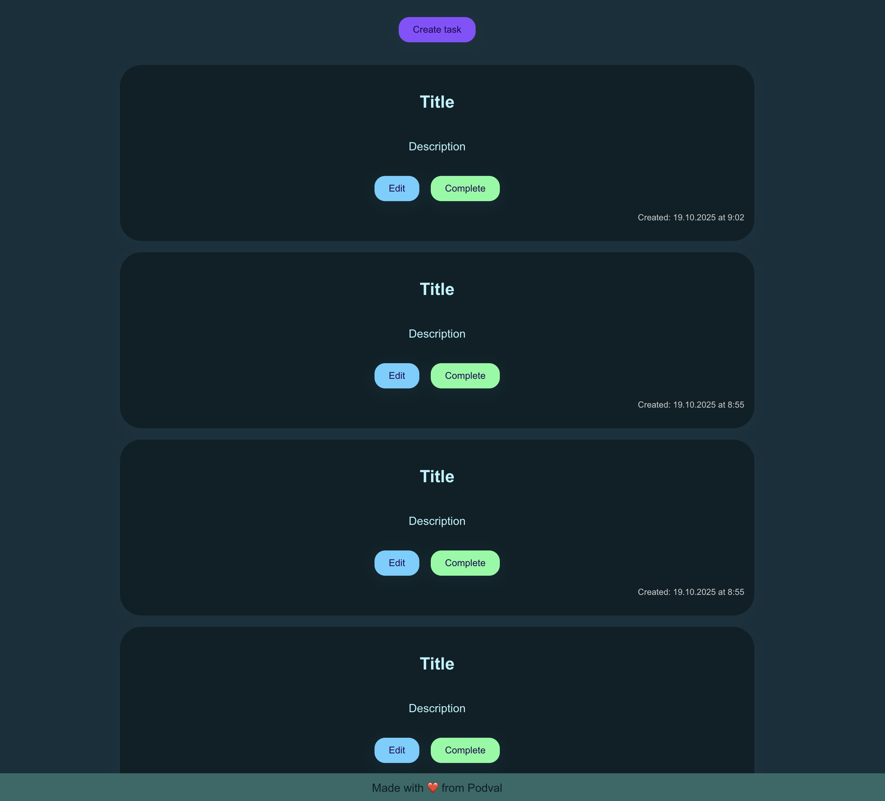

# TODO List Application

A full-stack TODO application with a modern UI built using Next.js, TypeScript, and MongoDB.



## Architecture

This project consists of two main parts:

### Frontend (`frontend`)

- **Framework**: Next.js 15.5.6 with React 19.1.0
- **Language**: TypeScript
- **Styling**: Custom CSS with responsive design
- **Features**:
  - Create, edit, and complete tasks
  - Real-time task updates
  - Inline editing with focus management
  - Responsive layout for mobile and desktop

### Backend (`backend`)

- **Runtime**: Node.js with Express 5.1.0
- **Database**: MongoDB with Mongoose 8.19.1
- **Language**: TypeScript
- **API**: RESTful API for task management
- **Features**:
  - CRUD operations for tasks
  - UUID-based task identification
  - Input validation
  - CORS enabled

## Project Structure

```
├── backend/
│   ├── src/
│   │   ├── controllers/    # Request handlers
│   │   ├── models/         # MongoDB schemas
│   │   ├── routes/         # API routes
│   │   ├── db/             # Database connection
│   │   └── types/          # TypeScript types
│   └── .env                # Environment variables
│
├── frontend/
│   ├── app/
│   │   ├── api/            # API client functions
│   │   ├── components/     # React components
│   │   ├── constants/      # App constants
│   │   └── types/          # TypeScript types
│   └── public/             # Static assets
│
└── README.md
```

## Getting Started

### Prerequisites

- Node.js (v20 or higher)
- MongoDB (running locally on port 27017)

### Installation & Setup

1. **Clone the repository**

   ```bash
   git clone <repository-url>
   cd Test_TODO
   ```

2. **Setup Backend**

   ```bash
   cd backend
   npm install
   ```

   Make sure your `.env` file contains:

   ```env
   PORT=5001
   MONGODB_URI=mongodb://localhost:27017/todolist
   NODE_ENV=development
   ```

3. **Setup Frontend**
   ```bash
   cd ../frontend
   npm install
   ```

### Running the Application

1. **Start MongoDB**

   ```bash
   # Make sure MongoDB is running on localhost:27017
   mongod
   ```

2. **Start Backend** (in `backend` directory)

   ```bash
   npm run dev
   ```

   Backend will run on http://localhost:5001

3. **Start Frontend** (in `frontend` directory)

   ```bash
   npm run dev
   ```

   Frontend will run on http://localhost:3000

4. **Open the application**

   Navigate to http://localhost:3000 in your browser

## API Endpoints

- `GET /api/tasks` - Get all tasks
- `POST /api/tasks` - Create a new task
- `PUT /api/tasks/:id` - Update a task
- `DELETE /api/tasks/:id` - Delete a task

## Features

- ✅ Create tasks with title and description
- ✅ Edit tasks inline with keyboard navigation
- ✅ Mark tasks as complete
- ✅ Automatic timestamp tracking
- ✅ Responsive design
- ✅ Dark theme UI

## Tech Stack

**Frontend:**

- Next.js 15.5.6 (with Turbopack)
- React 19.1.0
- TypeScript 5
- Custom CSS

**Backend:**

- Express 5.1.0
- MongoDB with Mongoose 8.19.1
- TypeScript 5.9.3
- UUID for unique IDs

---

Made with ❤️ from Podval
